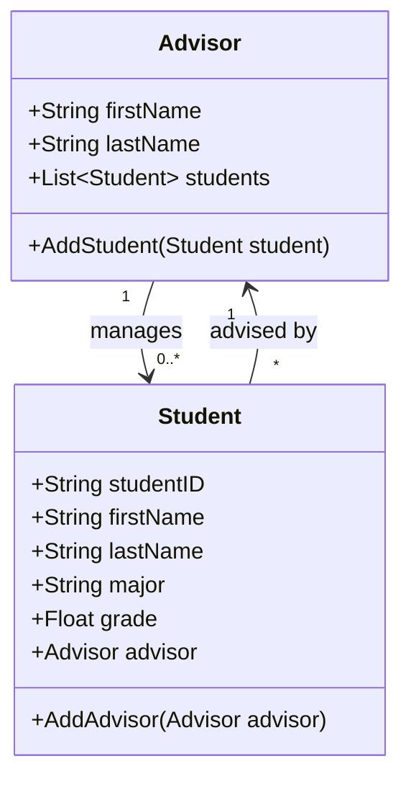

# unisystem
 
# โปรแกรมสำหรับอาจารย์บันทึกข้อมูลนักศึกษา

**ชื่อ: [อัยรดา โพธิ์ราศรี]**  
**รหัสนักศึกษา: [673450206-5]**

## Class Diagram

### คำอธิบายโครงสร้างคลาส:
## หลักการออกแบบเชิงวัตถุที่ใช้

### 1. **Encapsulation (การห่อหุ้มข้อมูล)**:
การห่อหุ้มข้อมูล (Encapsulation) ถูกใช้ในทั้งคลาส `Advisor` และ `Student` โดยการใช้ฟิลด์แบบส่วนตัว (private fields) สำหรับเก็บข้อมูลภายใน และให้คุณสมบัติสาธารณะ (public properties) สำหรับการเข้าถึงและแก้ไขข้อมูลเหล่านั้น ซึ่งจะช่วยปกป้องข้อมูลจากการถูกแก้ไขโดยตรงจากภายนอก และทำให้การเข้าถึงข้อมูลทำได้อย่างมีการควบคุมผ่านเมธอด

### 2. **Abstraction (การย่อข้อมูล)**:
คลาส `Advisor` และ `Student` ใช้การย่อข้อมูล (Abstraction) เพื่อซ่อนความซับซ้อนของระบบ โดยการสร้างเมธอดเพื่อเพิ่มนักศึกษาและจัดการอาจารย์ ซึ่งทำให้ส่วนของ UI สามารถทำงานกับอินเทอร์เฟซที่ง่ายขึ้น และไม่ต้องรู้รายละเอียดการทำงานภายใน

### 3. **Inheritance (การสืบทอด)**:
ในโปรแกรมนี้, การสืบทอด (Inheritance) ไม่ได้ถูกใช้อย่างชัดเจน (เนื่องจาก `Advisor` และ `Student` ไม่มีคลาสหลักร่วมกัน) แต่สามารถขยายได้ในอนาคต เช่น การสร้างคลาส `Person` ที่มีคุณสมบัติ `FirstName` และ `LastName` เพื่อให้ทั้ง `Advisor` และ `Student` สืบทอดจากคลาสนั้น

### 4. **Polymorphism (การหลายรูปแบบ)**:
การหลายรูปแบบ (Polymorphism) ใช้เมื่อมีการจัดการอาจารย์หลายคนในรูปแบบเดียวกัน การเชื่อมโยงนักศึกษากับอาจารย์จะทำให้สามารถจัดการกับอาจารย์และนักศึกษาหลายๆ คนในรูปแบบเดียวกันได้
